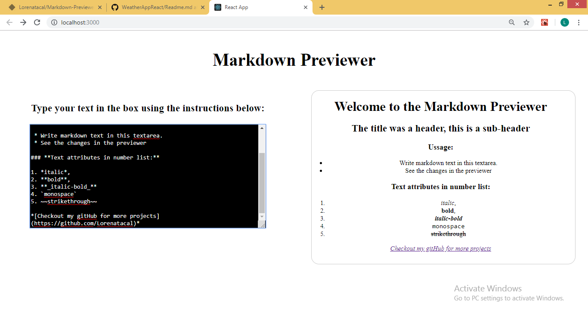

# Markdown Previewer

A React project in which the user can type a text in the left size and see the markdown previewer in the right.

 * Install and start the app:

    - ```clone the repo```
    - ```cd into the folder```
    - ```run npm install```
    - ```npm start```

## Screenshots



#### To see the game online:      https://markdown-previewer-app.herokuapp.com/

## Extra Info

To style the project I have used Styled Components. This was great learning oportunity as I have imported and used for the first time ReactMarkdown Component.